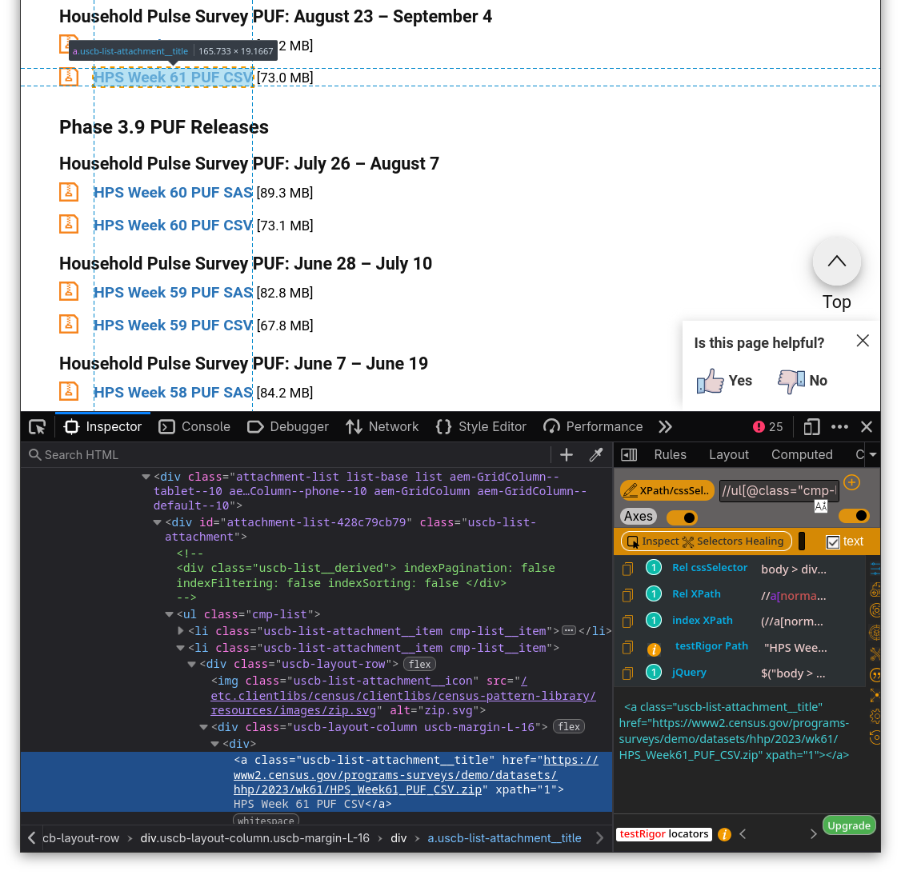
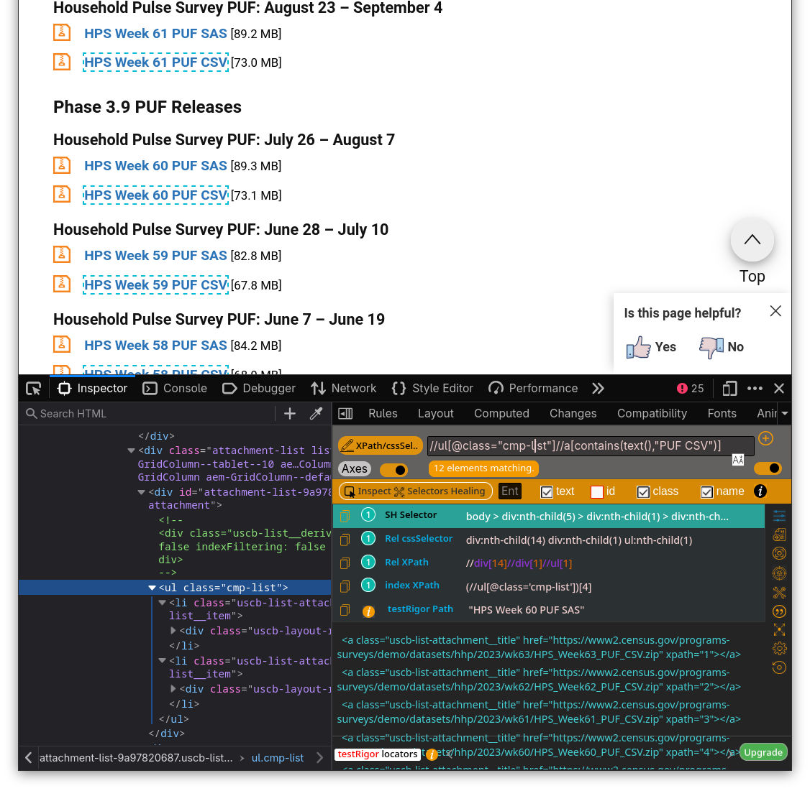
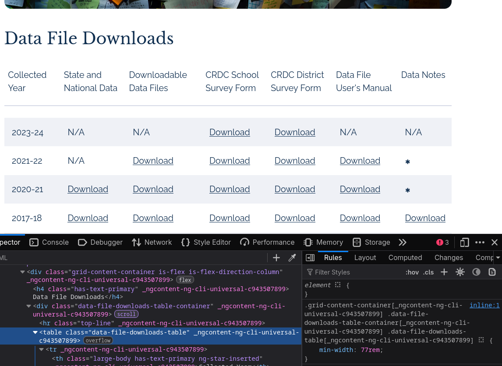

#  Intro {data-name="Intro"}

## Intro

* Slides are online [camille-s.github.io/webscraping](https://camille-s.github.io/webscraping)
* So is the code that generates them [ camille-s/webscraping](https://github.com/camille-s/webscraping)

## What is web scraping?

Web scraping is automation to go through tasks of getting documents from the internet and pulling information out of them

* Avoids routines of clicking on things on websites
* Run on a schedule
* Can crawl large websites 

## Why?

* Personally I mostly use scraping to batch download data
* Sometimes use it to get data out of allegedly-open data portals
* Support advocacy (friends & colleagues scrape court dockets & eviction filings, e.g. [ dismantl/CaseHarvester](https://github.com/dismantl/CaseHarvester))

. . .

* Other uses include testing during web development or monitoring website changes
* Also lots of bro applications, like info on crypto or training LLMs or whatever

## Tools

I mostly work in R, so if the HTML I'm after is static, I'll use R ([ tidyverse/rvest](https://github.com/tidyverse/rvest/) package is great)

If it isn't static I switch to Python to use [Selenium](https://www.selenium.dev/) within a Docker container [ SeleniumHQ/docker-selenium](https://github.com/SeleniumHQ/docker-selenium)

## Other tools

Other tools I don't have much/any experience with include 

* [ puppeteer/puppeteer](https://github.com/puppeteer/puppeteer)
* [ scrapy/scrapy](https://github.com/scrapy/scrapy)
* Libraries that build on the [Chrome DevTools Protocol](https://chromedevtools.github.io/devtools-protocol/)
* Other point-and-click / automated options

Also the RSelenium package is too outdated to use currently but is being developed again

#  Static websites

## Static websites

Static websites have their content ready to go when you visit them. They require fewer tools for scraping because you can just read the HTML and parse out what you need from it.

## Example 1: extract URLs 

This is a simplified version of a project I've done to batch download, clean, and build a database from the [microdata](https://www.census.gov/programs-surveys/household-pulse-survey/data/datasets.html) for the Census Bureau's Household Pulse Survey.

## About the data

* Started as rapid response at the beginning of covid lockdown
* Pandemic lasted longer than expected, so the survey did too
* As a result, infrastructure is messier than Census Bureau products would normally be
* Contained a (poorly worded) question on gender identity for later survey waves
    - One of [very few sources](https://ctdatahaven.org/report/invisible-data-excluded-research/) to do so, which is main reason I've used it

## The task

* Each year of the survey is on a different page, reached by a link on a tab
* Each iteration has a block of HTML with varying structure
    - Release date or cycle
    - Date range of survey
    - Links to zipped SAS & CSV files, sometimes supplemental files
    - Organized non-semantically into phases
    - Inconsistent naming

## Get to know the HTML

:::: {.columns}

::: {.column}

Find links to CSV files & mark with release dates/cycles

* Browser devtools help you investigate HTML, figure out what elements you're looking for
* Extensions can help verify XPath/CSS selectors

:::

::: {.column}



:::

::::

## Selectors


:::: {.columns}

::: {.column}


* Main types of selectors are CSS and XPath. Both are more complex than I can get into.
* CSS is simple but less flexible; XPath is much more powerful but tricky
  - Excellent XPath cheatsheet at [devhints.io/xpath](https://devhints.io/xpath)

:::

::: {.column}



:::

::::

## Let's write code!

Read the page source and set up a parser

```{python}
#| label: parse-setup
#| echo: true 
import requests
import pandas as pd
# from bs4 import BeautifulSoup
from lxml import html
import pprint

# get the html
cb_url = "https://www.census.gov/programs-surveys/household-pulse-survey/data/datasets.2023.html"
cb_resp = requests.get(cb_url)

# initiate a parser for the page source
cb_src = html.fromstring(cb_resp.content)
```

##  Plot twist

The information we want is hierarchical, but the HTML is not. So we have to dump everything into a list and nest it ourselves.

XPath for `<h3>`, `<h4>`, and `<a>` elements of interest:

* `//h3[contains(text(),"Phase")]`
* `//h4[contains(text(),"Household Pulse Survey PUF")]`
* `//ul[@class="cmp-list"]//a[contains(text(),"PUF CSV")]`

Luckily can combine all selectors into single XPath selector

##  Another plot twist

* [{BeautifulSoup}](http://www.crummy.com/software/BeautifulSoup/) package is very popular but doesn't take XPath
* [{lxml}](https://lxml.de/lxmlhtml.html) handles XPath so I'll use it

```{python}
#| label: elements
#| echo: true
elements = cb_src.xpath(
    "//h3[contains(text(), 'PUF')] | //h4 | //a[contains(text(), 'PUF CSV')]"
)
print(elements[0:4])
```

## Parsing {.smaller}

* For each element, get its tag and text
* If an `<a>`, also get its `href` attribute

```{python}
#| label: parsing
#| echo: true
def extract_info(element):
    tag = element.tag
    text = element.text
    if tag == "a":
        href = element.attrib["href"]
    else:
        href = None
    return {"tag": tag, "text": text, "href": href}

element_info = [extract_info(el) for el in elements]
pprint.pp(element_info[0:3])
```

## Clean up

Make a {pandas} `DataFrame` to clean up the data

```{python}
#| label: pandas1
#| echo: true
# Make a dataframe 
df = pd.DataFrame(element_info) 
df.head()
```

## Create properly nested data

Extract headers for each survey wave

```{python}
#| label: pandas2
#| echo: true
def extract_tag(row, t):
    if row.tag == t:
        return row.text
    else:
        return None

# Column for h3s
df["h3"] = df.apply(lambda row: extract_tag(row, "h3"), axis=1)

# Column for h4s
df["h4"] = df.apply(lambda row: extract_tag(row, "h4"), axis=1)
```

## Create properly nested data

Fill missing headers, then filter to keep one row per survey wave

```{python}
#| label: pandas3
#| echo: true
# fill h3s down
df["h3"] = df["h3"].ffill()

# fill h4s down within h3 groups
df["h4"] = df.groupby("h3")["h4"].ffill()

# keep only link rows
df = df.loc[df["tag"] == "a",]
```

## Finally have data

```{python}
#| label: pandas4
#| echo: true
df = df[["h3", "h4", "text", "href"]].rename(
    columns={"h3": "phase", "h4": "wave", "text": "name", "href": "url"}
)

df.head()
```


## That's it! (kinda)

We have a collection of 12 links to batch download our data. 

In my real project, I had to then parse all the dates and standardize labels, then do that for every year (this was the simplest year). 60 waves of the survey total.

After writing out all this metadata, I wrote a bash script to download all the data files and write them into a database. Then I set that up to run in GitHub Actions to check for updates & rebuild the database every week.

#  Dynamic websites

## Scraping dynamic websites

Dynamic websites don't have all their content available when you visit a URL. Scraping is similar, but takes extra steps to finagle the page source

* Sites filled by API calls or other servers
* Tables generated by form choices
* Crawling over pages of results

## It's complicated

Doing this requires a few additional tools that don't lend themselves to slides. My method is generally:

* Run Selenium in a docker container to mimic a headless browser
* Send Selenium web driver to website
* Click on stuff (forms, pager links, etc)
* Extract HTML from each iteration
* Repeat

## Example 2: stream URLs 


:::: {.columns}

::: {.column width="66%"}

This is another batch of federal datasets, this time much better formatted but loaded dynamically.

Clearly there's a table, but {requests} can't get it


:::

::: {.column width="33%"}



:::

::::
```{python}
#| label: dynamic
#| echo: true
ed_url = "https://civilrightsdata.ed.gov/data"
ed_resp = requests.get(ed_url)
ed_src = html.fromstring(ed_resp.content)
ed_src.xpath("//table")
```

##  Ghost computer

Selenium is fun because it's like a ghost is using your computer



(Not that interesting because it scrapes the table very fast)

#  Next steps

## Tips for getting started

Find a website that you want data from, study it with devtools, and see what you can get out of it

Your skills get better the more determined / annoyed you are

. . .

 Obligatory reminder to check the terms & services

## Thanks!

Check out & fork my federal data scraping adventures _while you still can_

* [ camille-s/acorns (miscellaneous datasets)](https://github.com/camille-s/acorns) 
* [ camille-s/loc (Library of Congress multimedia collections)](https://github.com/camille-s/loc)